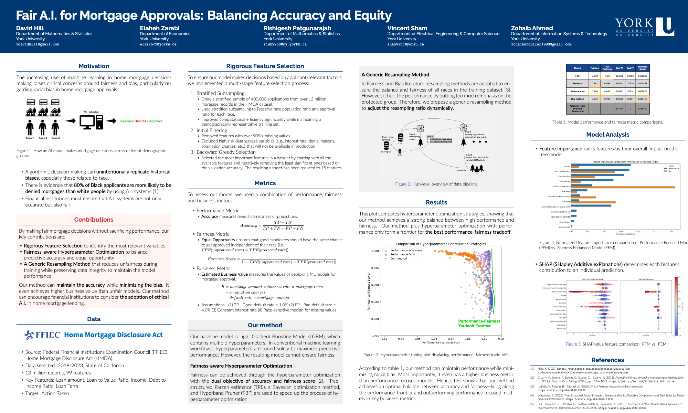

# Fairness-Aware LightGBM for Home Mortgage Analysis

This repository focuses on building fairness-aware machine learning models using LightGBM for home mortgage data analysis. The project emphasizes fairness metrics, hyperparameter optimization, and business metric evaluation to ensure equitable and effective decision-making.

## Project Structure

- **`business_metric.ipynb`**: Evaluates business metrics to assess the financial impact of the model.
- **`eda.ipynb`**: Performs exploratory data analysis (EDA) to understand the dataset and identify key patterns.
- **`hpo.ipynb`**: Implements hyperparameter optimization using Optuna for improved model performance.
- **`subsampling.ipynb`**: Handles dataset subsampling to manage large datasets efficiently.
- **`state_CA_2018.csv`**: Raw dataset containing home mortgage data for California in 2018.

## Key Features

- **Fairness Metrics**: Implements metrics like Equal Opportunity Difference (EOD) and Demographic Parity Difference (DPD) to evaluate fairness.
- **Hyperparameter Optimization**: Uses Optuna for Bayesian optimization to fine-tune LightGBM models.
- **Business Impact Analysis**: Assesses the financial implications of model predictions.
- **Scalable Data Handling**: Includes methods for subsampling and processing large datasets.

## Getting Started

### Prerequisites

- Python 3.8+
- Jupyter Notebook
- Libraries: `lightgbm`, `optuna`, `pandas`, `numpy`, `seaborn`

### Installation

1. Clone the repository:
   ```bash
   git clone https://github.com/vincentsham/fairness_aware_lgbm.git
   ```
2. Navigate to the project directory:
   ```bash
   cd fairness_aware_lgbm
   ```
3. Install the required libraries:
   ```bash
   pip install -r requirements.txt
   ```

### Usage

1. Open the Jupyter notebooks:
   ```bash
   jupyter notebook
   ```
2. Explore the notebooks in the following order:
   - `eda.ipynb` for data exploration.
   - `subsampling.ipynb` for dataset preprocessing.
   - `hpo.ipynb` for hyperparameter optimization.
   - `business_metric.ipynb` for business metric evaluation.

## Data Source

- The dataset used in this project is sourced from the [FFIEC Home Mortgage Disclosure Act (HMDA) Data Browser](https://ffiec.cfpb.gov/data-browser/data/2024?category=states).
- Detailed descriptions of the data fields can be found in the [Loan/Application Register (LAR) Data Fields documentation](https://ffiec.cfpb.gov/documentation/publications/loan-level-datasets/lar-data-fields).

## Project Poster



## Contributing

Contributions are welcome! Feel free to open issues or submit pull requests to improve the project.

## License

This project is licensed under the MIT License. See the [LICENSE](LICENSE) file for details.

## Acknowledgments

- [LightGBM](https://github.com/microsoft/LightGBM)
- [Optuna](https://github.com/optuna/optuna)
- Open-source contributors and the data science community.
